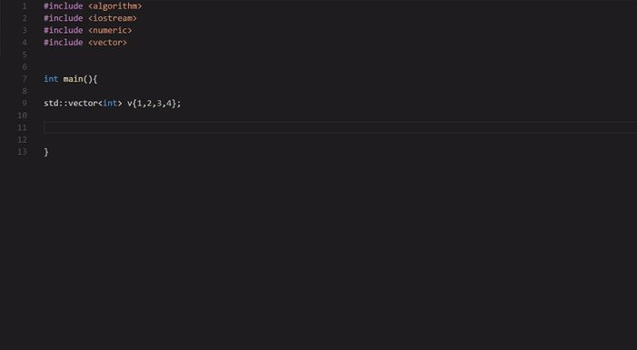
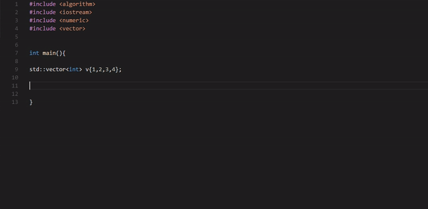

# C++ Algorithm Mnemonics for Visual Studio Code

## Usage
Just type the mnemonic and press Enter or Tab to expand the template. Use Tab to cycle between placeholders for inserting content.

Or use the Trigger Suggest command (Default: Ctrl+Space (Windows, Linux) or Cmd+Space (OSX)).

## Build & Pack to VSIX

npm run install
npm run pack